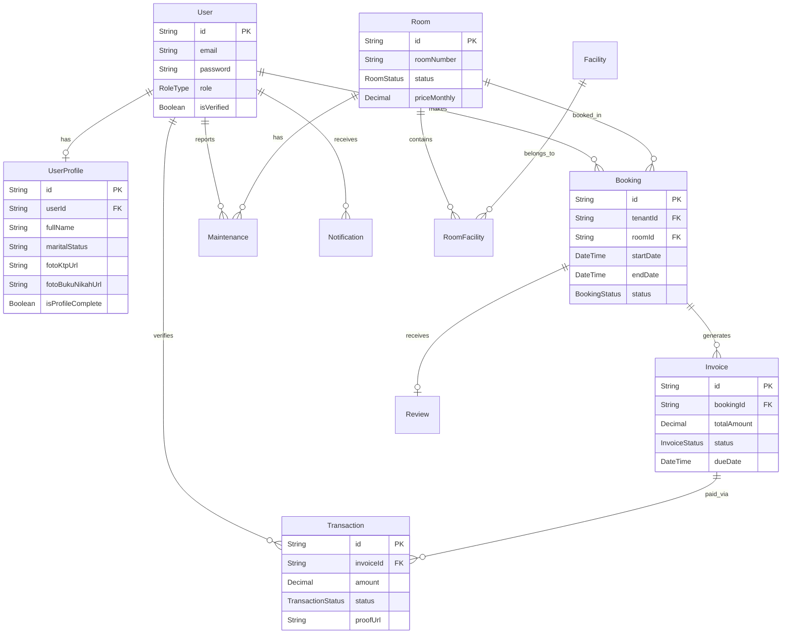

# Emerald Kos - Booking & Boarding House Management System (Frontend)

Comprehensive frontend application for Emerald Kos (Boarding House) Management, built with Next.js App Router, Tailwind CSS, and Shadcn UI. This system seamlessly integrates with the NestJS backend to provide a robust, role-based platform for both Admins and Tenants.

## 🚀 Tech Stack & Deployment

- **Framework**: [Next.js 15](https://nextjs.org/) (App Router)
- **Styling**: [Tailwind CSS](https://tailwindcss.com/)
- **UI Components**: [Shadcn UI](https://ui.shadcn.com/)
- **Form & Validation**: React Hook Form + Zod
- **Data Visualization**: Recharts
- **HTTP Client**: Axios (with custom interceptors for Enveloped Responses and File Uploads)
- **Deployment**: [Vercel](https://vercel.com/) (Frontend Hosting)

---

## 🔗 Live Deployments

- **Frontend Application**: [https://crack-fe-khankhanfauzan.vercel.app](https://crack-fe-khankhanfauzan.vercel.app)
- **Backend API (Swagger)**: [https://crack-be-khankhanfauzan.onrender.com/api](https://crack-be-khankhanfauzan.onrender.com/api)

*(Note: The backend is hosted on Render's free tier and may take ~1-2 minutes to spin up on the first request).*

---

## ✨ List of Features

### 🏢 Admin Features
- **Dashboard Summary**: View key metrics (Total Tenants, Occupancy, Outstanding Invoices), recent activities, and maintenance tickets in real-time.
- **Room Management**: Monitor room availability and statuses.
- **Booking Approvals**: Review tenant KYC documents (KTP, Marriage Certificate) and approve/reject booking requests.
- **Invoice & Payment Verification**: Review uploaded payment proofs from tenants and verify transactions (Partial/Full Payment).
- **User Management**: Manage tenant accounts, view profiles, and update data.
- **Maintenance Tracking**: Update the status of tenant complaints (`open`, `in_progress`, `resolved`, `closed`) and add admin notes.

### 👤 Tenant Features
- **Browse & Search Rooms**: Interactive grid and list view to search, filter (by status), and select available rooms.
- **Booking System**: Select rent type (Daily/Monthly/Yearly), duration, and start date. Supports indefinite extension for current tenants.
- **Payment Portal**: Upload payment proofs (`multipart/form-data`) securely for pending invoices.
- **Maintenance & Complaints**: Submit maintenance requests with photo evidence.
- **Profile & KYC**: Complete user profile and upload mandatory KYC documents (KTP, Marriage Book) before booking.
- **Personal Dashboard**: View active bookings, upcoming invoice due dates, and recent transactions.

---

## 🛠 Installation & Usage Instructions

### Prerequisites
- Node.js (v18 or higher)
- npm, yarn, or pnpm

### Setup
1. **Clone the repository:**
   ```bash
   git clone <repository-url>
   cd crack-fe-khankhanfauzan
   ```

2. **Install dependencies:**
   ```bash
   npm install
   # or
   yarn install
   ```

3. **Environment Variables:**
   Create a `.env.local` file in the root directory and add the backend API URL:
   ```env
   NEXT_PUBLIC_API_BASE_URL=http://localhost:3000
   # Or the production URL:
   # NEXT_PUBLIC_API_BASE_URL=https://crack-be-khankhanfauzan.onrender.com
   ```

4. **Run the development server:**
   ```bash
   npm run dev
   # or
   yarn dev
   ```

5. **Access the application:**
   Open [http://localhost:3000](http://localhost:3000) in your browser.

---

## 📸 Application Screenshots

*(Replace these placeholders with actual images of your application before final submission)*

### Admin Role
- **Admin Dashboard:** `[Insert Screenshot Here]`
- **Booking Approvals (KYC View):** `[Insert Screenshot Here]`
- **Invoice Verification:** `[Insert Screenshot Here]`

### Tenant Role
- **Browse Rooms & Filter:** `[Insert Screenshot Here]`
- **Tenant Dashboard:** `[Insert Screenshot Here]`
- **Payment Proof Upload:** `[Insert Screenshot Here]`

---

## 🔐 Architecture & Security Highlights

1. **Role-Based Authorization (Middleware)**
   - Implemented at the edge using Next.js `proxy.ts` (Middleware).
   - `/admin/*` routes are strictly protected and redirect `tenant` users.
   - `/user/*` routes are strictly protected and redirect `admin` users.
   - Unauthenticated users are forced to `/login`.

2. **Server & Client Components**
   - Utilizes Next.js Server Components for heavy data fetching (e.g., Admin Dashboard Summary) to improve initial load and SEO.
   - Client Components are used for interactive UI elements (Forms, Charts, Search/Filters).

3. **Robust Form Handling & File Uploads**
   - Seamless integration with Backend DTOs.
   - Custom HTTP Client automatically formats `multipart/form-data` boundaries for uploading images (KYC, Maintenance) to Cloudinary via the backend.

---

## 📊 Database Entity Relationship Diagram (ERD)

*(This is the data structure utilized by the Backend API which drives this Frontend)*


